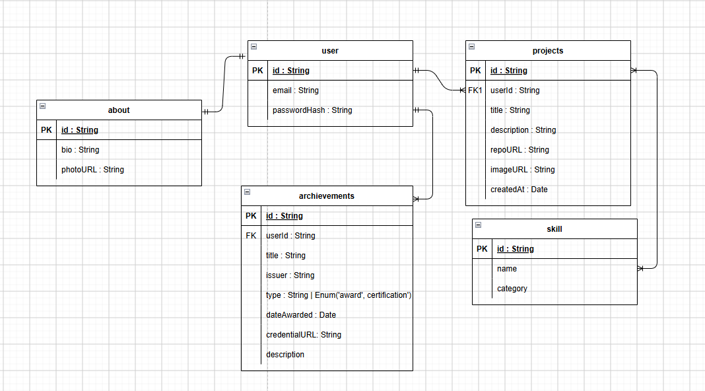

# Database Design

## Entities

### User
The site admin. There is only ever one active admin account.

| Field | Type | Notes |
|---|---|---|
| `_id` | ObjectId | Primary key |
| `email` | String | Unique, used for login |
| `passwordHash` | String | Bcrypt-hashed, never stored in plaintext |

### Project
A portfolio project entry.

| Field | Type | Notes |
|---|---|---|
| `_id` | ObjectId | Primary key |
| `userId` | ObjectId | References `User` |
| `title` | String | Required |
| `description` | String | Required |
| `repoUrl` | String | Optional link to source code |
| `imageUrl` | String | Cloudinary URL |
| `skills` | [ObjectId] | References `Skill` (many-to-many) |
| `createdAt` | Date | Auto-generated |

### Skill
A reusable tag (e.g. "React", "MongoDB", "Java").

| Field | Type | Notes |
|---|---|---|
| `_id` | ObjectId | Primary key |
| `name` | String | Unique |
| `category` | String | e.g. "Language", "Framework", "Tool" |

### About
Singleton document for bio/profile content — there is only ever one.

| Field | Type | Notes |
|---|---|---|
| `_id` | ObjectId | Primary key |
| `bio` | String | Rich text or markdown |
| `photoUrl` | String | Cloudinary URL |

### Achievement
An award or certification (e.g. academic honours, TestGorilla
assessment, short learning programmes).

| Field | Type | Notes |
|---|---|---|
| `_id` | ObjectId | Primary key |
| `userId` | ObjectId | References `User` |
| `title` | String | Required, e.g. "UJenius Academic Achievement Award" |
| `issuer` | String | Required, e.g. "University of Johannesburg" |
| `type` | String | Enum: `award` \| `certification` |
| `dateAwarded` | Date | Required |
| `credentialUrl` | String | Optional link to verify (e.g. results page) |
| `description` | String | Optional |

## Relationships

- **User → Project**: one-to-many. One admin owns many projects.
- **Project ↔ Skill**: many-to-many. A project can have multiple
  skill tags; a skill can appear across multiple projects.
- **User → About**: one-to-one. A single bio document per admin.
- **User → Achievement**: one-to-many. One admin earns many
  awards/certifications.

## Design decisions

- **Project–Skill as an array of references, not a join collection.**
  MongoDB favours embedding or referencing over relational joins.
  Storing `skills: [ObjectId]` directly on the project document keeps
  reads simple (one query, populate the array) without the overhead
  of a separate join collection that a relational database would
  require.
- **About is a singleton, not a list.** Modelled as its own collection
  with exactly one document, rather than embedding it into `User`,
  so it can be fetched independently and cached on the frontend
  without pulling admin credentials along with it.
- **Skills are a separate collection, not free-text strings on
  Project.** This avoids duplicate/inconsistent tag names (e.g.
  "React" vs "react.js") and allows skills to carry their own
  metadata (category) for filtering on the frontend later.
- **Awards and certifications share one `Achievement` collection,**
  distinguished by a `type` field, rather than two near-identical
  collections. They have the same shape (title, issuer, date,
  optional credential link) and are typically displayed together on
  a portfolio, so one collection with a filterable `type` avoids
  duplicating the schema and the CRUD endpoints.

See [ADR 0002](../adr/0002-mongodb-over-postgresql.md) for why MongoDB
was chosen over a relational database for this project.