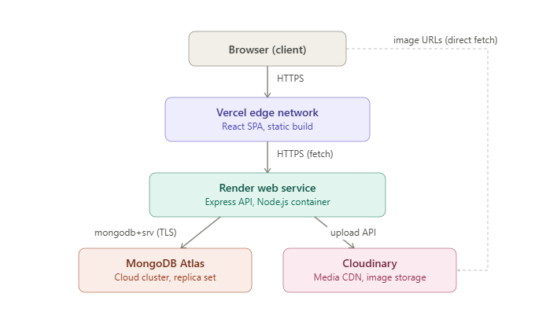

# Deployment Model

## Overview

This describes the physical deployment view — where each component
actually runs and what protocol connects it to the next, as opposed
to the logical architecture described in [architecture.md](./architecture.md).

## Hosted components

| Component | Host | Notes |
|---|---|---|
| React frontend | Vercel | Static build served from Vercel's edge network. Auto-deploys on push to `main`. |
| Express API | Render | Node.js web service container. Auto-deploys on push to `main`. |
| Database | MongoDB Atlas | Cloud-hosted cluster (replica set), free tier. |
| Images | Cloudinary | Media CDN for uploaded project/profile images. |

## Connections

1. **Browser → Vercel** — HTTPS. Loads the static React build.
2. **React app → Render** — HTTPS `fetch` calls to the REST API
   (`GET` endpoints public, `POST`/`PUT`/`DELETE` require a JWT).
3. **Render → MongoDB Atlas** — `mongodb+srv://` connection string
   over TLS, established once at server startup.
4. **Render → Cloudinary** — HTTPS, used only when the admin uploads
   a new image via the dashboard.
5. **Browser → Cloudinary** — direct HTTPS fetch for image URLs.
   Once the API returns a Cloudinary URL, the browser loads the image
   straight from Cloudinary's CDN rather than proxying it through the
   Express server. This keeps the API lightweight and images load
   from Cloudinary's edge network rather than Render's.

## Environment configuration

Each hosted service reads its configuration from environment
variables, never from committed code:

| Variable | Set on | Purpose |
|---|---|---|
| `MONGODB_URI` | Render | Connection string for Atlas |
| `JWT_SECRET` | Render | Signs and verifies auth tokens |
| `CLOUDINARY_URL` | Render | Cloudinary API credentials |
| `VITE_API_BASE_URL` | Vercel | Points the frontend at the Render API URL |

## Why this hosting setup

- **Vercel** — free tier, git-push-to-deploy, purpose-built for
  Vite/React static builds, instant HTTPS and a global CDN.
- **Render** — free tier for small Node APIs, git-based deploys,
  simple environment variable management.
- **MongoDB Atlas** — free 512MB cluster is more than enough for a
  portfolio's content volume; no self-hosted database maintenance.
- **Cloudinary** — free tier, handles image transformation/CDN
  delivery without building that into the API.