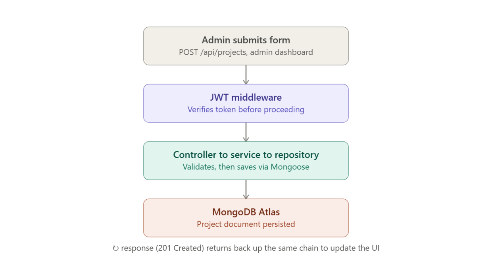

# Sequence Diagrams

These trace specific actions through the system over time, showing
how requests move through each architectural layer.

## Create a project (admin, authenticated)

1. **Admin submits form** — the admin dashboard sends
   `POST /api/projects` with the new project data and an
   `Authorization: Bearer <JWT>` header.
2. **JWT middleware** — verifies the token before the request is
   allowed to proceed. If invalid or missing, the request is rejected
   with `401 Unauthorized` and none of the layers below are reached.
3. **Controller → Service → Repository** — the controller parses the
   request body and calls the service layer, which validates the
   fields (e.g. required `title`, valid `skills` references) and
   applies any business rules. The repository is the only layer that
   calls Mongoose directly to persist the document.
4. **MongoDB Atlas** — the project document is saved.
5. **Response** — a `201 Created` response, containing the saved
   project, flows back up through the same chain (repository →
   service → controller → route) to the admin dashboard, which
   updates the UI.

## Public visitor views projects (unauthenticated)

1. **Recruiter's browser** requests the portfolio site from Vercel.
2. **React frontend** calls `GET /api/projects` — no JWT required.
3. **Controller → Service → Repository** — the repository fetches all
   project documents from MongoDB, with skills populated.
4. **Response** — the project list returns as JSON and the frontend
   renders it.

## Admin login

1. **Admin submits credentials** (email + password) to
   `POST /api/auth/login`.
2. **Service layer** looks up the user by email, then uses `bcrypt`
   to compare the submitted password against `passwordHash`.
3. If valid, the service signs a JWT (`jsonwebtoken`) containing the
   user ID and an expiry, and returns it in the response.
4. **Frontend** stores the JWT (e.g. in memory or `localStorage`) and
   attaches it to the `Authorization` header on all subsequent write
   requests.

See [ADR 0003](../adr/0003-jwt-over-session-auth.md) for why JWTs
were chosen over server-side sessions for this flow.